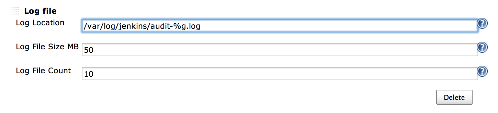
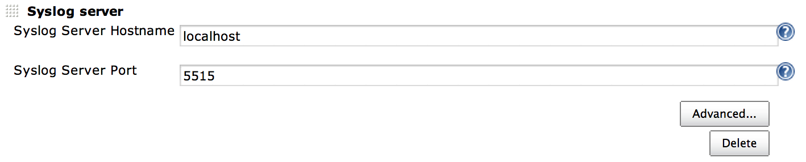
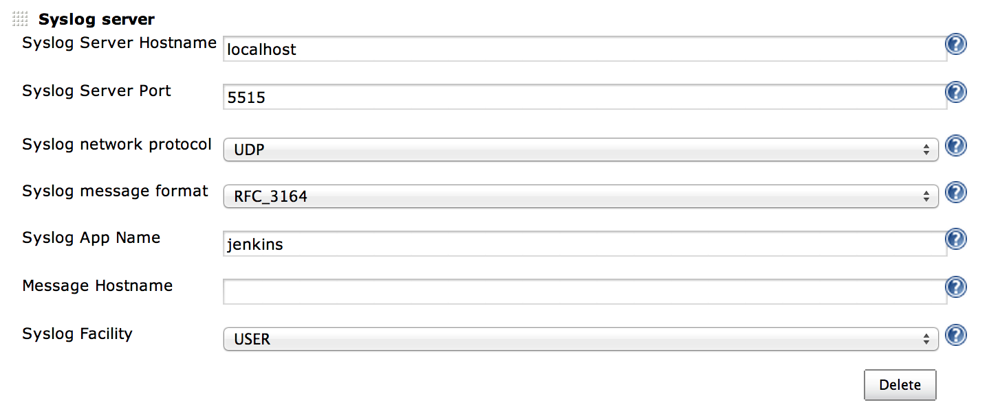
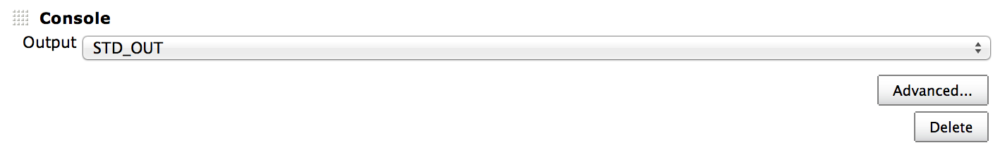

= Audit Trail Plugin

image:https://img.shields.io/jenkins/plugin/v/audit-trail.svg[link=https://plugins.jenkins.io/audit-trail]
image:https://img.shields.io/github/release/jenkinsci/audit-trail-plugin.svg?label=changelog[link=https://github.com/jenkinsci/audit-trail-plugin/releases/latest]
image:https://img.shields.io/jenkins/plugin/i/envinject-api.svg?color=blue[https://plugins.jenkins.io/audit-trail]

This plugin keeps a log of who performed particular Jenkins operations, such as configuring jobs.

This plugin adds an _Audit Trail_ section in the main Jenkins
configuration page.
On this page, you can configure log destination and settings
(eg file size and number of rotating log files), and a URI pattern for
requests to be logged.
The default options select most actions with
significant effect such as creating/configuring/deleting jobs and views
or delete/save-forever/start a build.
The log is written to disk as
configured and recent entries can also be viewed in the Manage / System
Log section.

Also see the
https://wiki.jenkins.io/display/JENKINS/JobConfigHistory+Plugin[JobConfigHistory
Plugin] for recording actual changes made to job configurations.

== Configuration

=== File logger

Output audit logs in rolling files.

The file logger relies on `java.util.logging.FileHandler` and can use
patterns to describe the log file location as documented
http://docs.oracle.com/javase/7/docs/api/java/util/logging/FileHandler.html[here]
(`+%h+`, `+%g+`...).

=== Syslog logger

Send audit logs to a Syslog server.

=== Console logger

Output audit logs in `stdout` or `stderr`.
Primarily intended for debugging purpose.

== Changelog
ifdef::env-github,env-browser[:outfilesuffix: .adoc]

From version 2.5 on, changelog is automatically generated using
https://github.com/toolmantim/release-drafter[release-drafter]. See
directly
the https://github.com/jenkinsci/audit-trail-plugin/releases[GitHub
release page for the plugin].

For older releases, have a look to the <<CHANGELOG#,archive>>.
